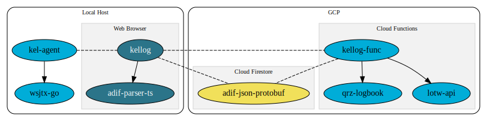

# K0SWE GitHub

This organization contains amateur radio projects for Chris, K0SWE. Primarily,
these repositories are components for the KelLog web-based contact logger.

## KelLog repositories

### Web application

* [KelLog](https://github.com/k0swe/kellog)
* [adif-parser-ts](https://github.com/k0swe/adif-parser-ts)

### Agent program

* [kel-agent](https://github.com/k0swe/kel-agent)
* [wsjtx-go](https://github.com/k0swe/wsjtx-go)

### Cloud Functions

* [kellog-func](https://github.com/k0swe/kellog-func)
* [qrz-logbook](https://github.com/k0swe/qrz-logbook)
* [lotw-api](https://github.com/k0swe/lotw-api)

### Firestore schema

* [adif-json-protobuf](https://github.com/k0swe/adif-json-protobuf)
