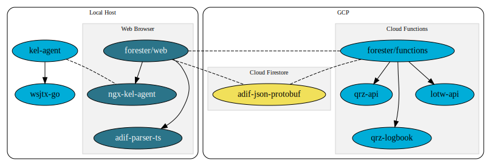

# K0SWE GitHub

This organization contains amateur radio projects for Chris, K0SWE. Primarily, these repositories
are components for the Forester web-based contact logger.

## Forester repositories

### Web application

* [Forester](https://github.com/k0swe/forester)
  
* [adif-parser-ts](https://github.com/k0swe/adif-parser-ts)
  
* [ngx-kel-agent](https://github.com/k0swe/ngx-kel-agent)
  

### Agent program

* [kel-agent](https://github.com/k0swe/kel-agent)
  
* [wsjtx-go](https://github.com/k0swe/wsjtx-go)
  

### Cloud Functions

* [forester-func](https://github.com/k0swe/forester-func)
  
* [qrz-api](https://github.com/k0swe/qrz-api)
  
* [qrz-logbook](https://github.com/k0swe/qrz-logbook)
  
* [lotw-api](https://github.com/k0swe/lotw-api)
  

### Firestore schema

* [adif-json-protobuf](https://github.com/k0swe/adif-json-protobuf)
  
  

## Mountaineer

The K0SWE organization is also home to the [Mountaineer](https://github.com/k0swe/mountaineer)
open-source hardware radio interface device.
